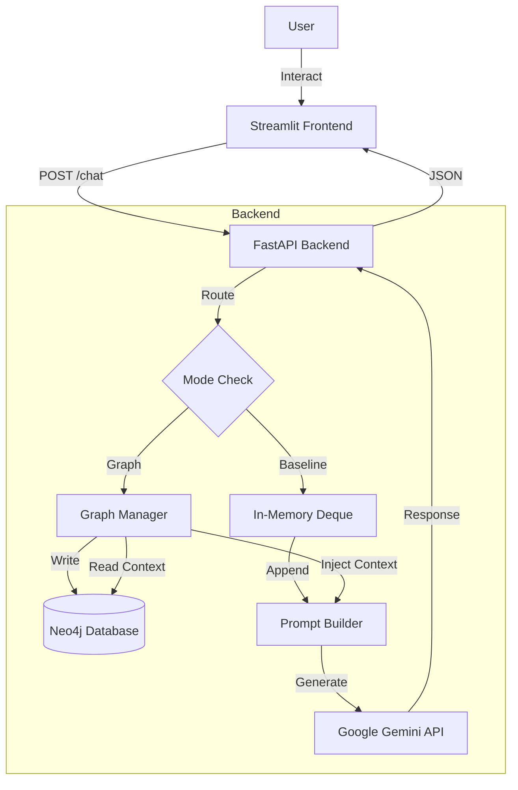

# GraphRAG 🧠

> **Linked-Memory Graphs for Contextual Adaptation in LLM-based Dialogue Systems**

[](https://www.python.org/downloads/)
[](https://streamlit.io/)
[](https://neo4j.com/)
[](LICENSE)

## 📌 Overview

**GraphRAG** is a dual-mode conversational AI system designed to demonstrate the power of **structured knowledge graphs** over traditional linear conversation history. It features an A/B testing architecture allowing real-time comparison between:

1.  **Baseline Mode**: Traditional sliding-window memory (last 5 interactions).
2.  **Graph Mode**: Graph-persisted memory with entity-relational context retrieval.

The system uses **spaCy** for Named Entity Recognition (NER) to extract entities/topics and **Neo4j** to build a dynamic knowledge graph of user interactions, enabling the LLM (Google Gemini) to "remember" long-term context non-linearly.

---

## 🚀 Key Features

-   **Dual Retrieval Modes**: Seamlessly toggle between Baseline (Text) and Graph (Neo4j) memory.
-   **Knowledge Graph Construction**: Automatically builds nodes (`User`, `Event`, `Entity`, `Topic`) and relationships (`MENTIONS`, `ASKED_ABOUT`) in real-time.
-   **Context Retention Scoring (CRS)**: An automated evaluation metric to measure how well the LLM retains and uses provided context.
-   **Modern UI**: A responsive, dark-themed Streamlit interface with real-time graph visualization (via metrics).

---

## 🏗️ Architecture

The system follows a clean separation of concerns:



---

## ⚡ Quick Start

### 1. Prerequisites
-   Python 3.10+
-   Neo4j Database (AuraDB or Local)
-   Google Cloud API Key (Gemini)

### 2. Installation

```bash
# Clone repository
git clone https://github.com/your-username/graph-rag.git
cd graph-rag

# Install dependencies
python -m pip install -r requirements.txt

# Download NLP model
python -m spacy download en_core_web_sm
```

### 3. Configuration

Create a `.env` file in the root directory:

```ini
GEMINI_API_KEY=your_gemini_key_here
NEO4J_URI=neo4j+s://your-db-instance.databases.neo4j.io
NEO4J_USERNAME=neo4j
NEO4J_PASSWORD=your_password
# Optional: Deploy URL
# BACKEND_URL=http://localhost:8000/chat
```

### 4. Run the System

**Terminal 1: Backend**
```bash
uvicorn backend.main:app --reload
```

**Terminal 2: Frontend**
```bash
streamlit run frontend/ui.py
```

Access the UI at `http://localhost:8501`.

---

## 🎓 Demo & Presentation Notes

Use this flow to demonstrate the system's capabilities:

1.  **Start in Baseline Mode**: Ask a question like *"Who is the CEO of Apple?"*. Then ask *"Who founded it?"*.
    *   *Observation*: It works for immediate context.
2.  **Switch to Graph Mode**: Ask *"Tell me about Neo4j."* The system extracts "Neo4j" as an entity.
3.  **Simulate Memory Gap**: Clear history or restart the app.
4.  **Recall Test**: In Graph Mode, ask *"What did I ask you about databases earlier?"*.
    *   *Observation*: The system retrieves the "Neo4j" interaction from the graph, even though the session history is gone. Baseline mode would fail here.
5.  **Show the Graph**: Open your Neo4j Browser to visualize the growing web of `(User)-[:ASKED_ABOUT]->(Event)-[:MENTIONS]->(Entity)`.

---

## 🔮 Future Roadmap

-   **Graph Visualization**: Embed an interactive graph view (e.g., using `streamlit-agraph`) directly in the UI.
-   **Vector Hybrid**: Combine graph traversal with vector similarity search for unstructured context.
-   **Multi-User Auth**: Replace simple `user_id` string with OAuth for secure multi-user partitioning.
-   **Advanced Ontologies**: Expand the graph schema to support complex relations beyond simple "MENTIONS".

---

## 🛡️ License

This project is licensed under the MIT License - see the [LICENSE](LICENSE) file for details.
